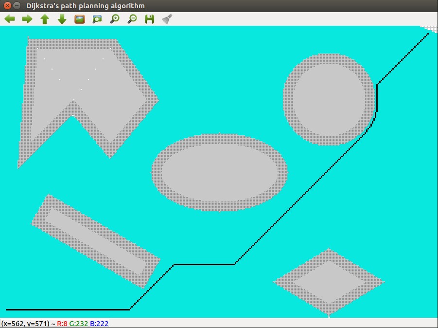

# Djikshtra-Implementation-CPP
This is an implementation of Dijkstra's Algorithm in C++. 

This project includes 2 source files:
- Dijkstra_point.cpp
- Dijkstra_rigid.cpp

Run them as follows on an ubuntu system (replace file with the actual name of the source file): 
```
g++ -std=c++11 file.cpp -o file `pkg-config --libs --cflags opencv-3.3.1-dev`
./file
```


<p align="center">
  <p align="center"></p>
  <br><b>Figure 1 - Optimal Path found by Djikshtra algorithm</b><br>
</p>

The user will now be prompted to enter valid coordinates of the start and goal point relative to an axis on the bottom left corner of the image (world frame). Once a valid input is entered such that the point lies in the image plane and not in the obstacle region, exploration begins and the shortest path is determined between the start and goal node. 

In a window that pops up, you can see the obstacles in gray, the goal location in green and the explored nodes in blue. Finally, the path is shown in black. 

Note: The solve time from start:(5,5) to goal(295, 195) is 1123ms without visualization and 30 min with visualization.

